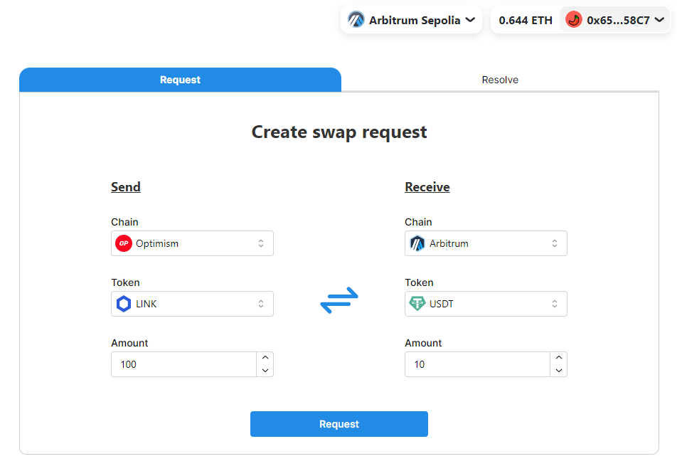
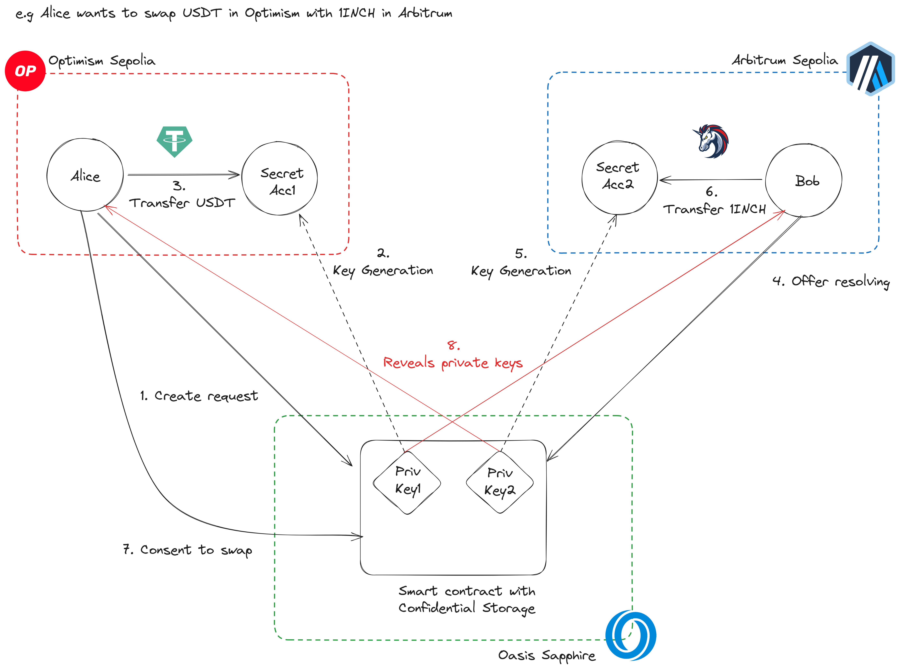

# MoleSwap: A Novel Cross-Chain Swap Protocol Inspired by Intent Architecture

**This product is developed during [ETHDam2024](https://taikai.network/en/cryptocanal/hackathons/ethdam2024/overview)**

A cross chain swap protocol using account secret keys swap and secure key management by Oasis Sapphire, all without relying on central servers such as relayers.

## Overview

MoleSwap is a cross-chain swap protocol inspired by the Intent architecture that enables peer-to-peer asset swaps without relying on off-chain servers like relayers. MoleSwap's innovative approach addresses the limitations of existing cross-chain swap solutions and paves the way for a more secure, decentralized, and versatile cross-chain asset exchange ecosystem.

## Key Highlights

Peer-to-peer swaps: Eliminates reliance on off-chain servers and relayers.
Flexible asset swaps: Supports a wide range of tokens without liquidity provider limitations.
Cross Chain NFT purchases: Enables NFT purchases using tokens from other chains.
Decentralized architecture: Leverages Oasis Sapphire for secure key management and eliminates reliance on centralized messaging protocols.
Problems:
While existing cross-chain swaps like Stargate and Hop Protocol have reached practical use, they still face challenges such as long swap completion times and limited support for chains and tokens. Additionally, swap solutions based on the lock-mint model carry the risk of asset loss due to smart contract bugs.

## Ideas

MoleSwap introduces a novel swap protocol utilizing the simple concept of account exchange. Leveraging Oasis Sapphire's confidential storage, it generates and manages secret keys, revealing them only upon mutual agreement between parties. Secret keys are shared exclusively with the intended recipient.

## How it works

Before initiating a swap, keys are generated within Oasis Sapphire, and only their addresses are revealed. Parties deposit the required tokens on their respective chains into the corresponding accounts. They then verify and agree upon each other's account balances. Once mutual agreement is confirmed within the smart contract, each party reveals the key to the other's account, containing assets different from what they originally sent.

## Advantages

At its core, MoleSwap is a key exchange protocol, eliminating the constraints on swappable chains and tokens as it operates without liquidity providers. It also enables purchasing NFTs using tokens from other chains.

Moreover, MoleSwap eliminates the need for cross-chain messaging protocols like relayers, offering the advantage of not relying on centralized off-chain servers.

## What I've done so far

I successfully implemented a smart contract for key management on Oasis Sapphire and a WebUI using Next.js, demonstrating the feasibility of cross-chain swaps.

## Future plans

Future plans include implementing features such as automatic token deposit notification to Oasis Sapphire via Oasis Privacy Layer and Cellar Inter-chain Messaging to enhance user experience. Additionally, the team aims to explore privacy-enhancing features that prevent the disclosure of swappable tokens and addresses to the public.

## Contracts

### Oasis Sapphire

#### AtomicSwapManager

- [0xf125A87614fe2Da9d815f5943EDfeF6bB3E0B521](https://explorer.oasis.io/testnet/sapphire/address/0xf125A87614fe2Da9d815f5943EDfeF6bB3E0B521)
  - [Verification](https://repo.sourcify.dev/contracts/full_match/23295/0xf125A87614fe2Da9d815f5943EDfeF6bB3E0B521/)

### Optimism

#### FundManager

- [0x3E3610db8434d8390154FA32052E64f7C20b82aA](https://sepolia-optimism.etherscan.io/address/0x3E3610db8434d8390154FA32052E64f7C20b82aA)

#### ERC20 (Demo Tokens)

- 1INCH: 0x9a7068673fcC204a1B456f6A3fD92512729491b1
- LINK: 0xDa711213bdd15dafd0DFAF8F65864fD93E4dCB61
- DAI: 0x6Ea1942BD29CE4Fad56A6d01969e6fe89Ba725ba
- USDC: 0xa30eA3F79Fb608cf90D617Ca8F00A6CB2A0C928e
- USDT: 0x6BAd482b7898e9aA4a0a6F78C04477b2c6949984

### Arbitrum

#### FundManager

- [0x431117919fbaFEDa10230c2bA3Bd2866C61aD5BE](https://sepolia.arbiscan.io/address/0x431117919fbaFEDa10230c2bA3Bd2866C61aD5BE)

#### ERC20 (Demo Tokens)

- 1INCH: 0x85B1188879F9ae6FddeADc3b514Fa30A95d6fB7E
- LINK: 0x027CdE649084f09DB9EB88AAbBC990444832bd2d
- DAI: 0x44F8bcb1876aFc6406E27141373b7bf2d36b017f
- USDC: 0xA104B9b8A02499d03bD81a885677d17a3D7cA799
- USDT: 0x6C8Da5ceDcEF1cb9b62d4F590F8E69f7746cF692
